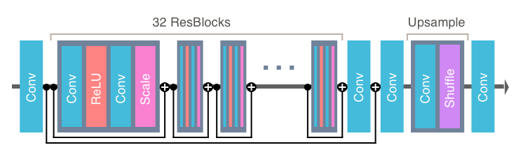

## Enhanced Deep Super Resolution Network

This repository is based off of an official PyTorch implementation of the paper [EDSR](https://arxiv.org/abs/1707.02921) that can be found [here](https://github.com/thstkdgus35/EDSR-PyTorch). This PyTorch implementation is itself based off of an original Lua implementation, which can be found [here](https://github.com/LimBee/NTIRE2017).

We provide scripts for reproducing all the results from our paper. You can train your own model from scratch, or use pre-trained model to enlarge your images.


### Dependencies

* Python 3.6
* PyTorch >= 0.4.0
* numpy
* skimage
* imageio
* matplotlib
* tqdm
* cv2 >= 3.xx (Only if you use video input/output)


### EDSR Architecture

We used PyTorch to implement the architecture from the paper ["Enhanced Deep Residual Networks for Single Image Super-Resolution"](https://arxiv.org/abs/1707.02921) as depicted here:

<div align="center">
	
</div>


### Preparing Data

* Download the data and update the defaults for arguments in `src/option.py`.
	* In this experiment, we used images from [DIV2K](https://data.vision.ee.ethz.ch/cvl/DIV2K/), a dataset that provides 800 high resolution images for training and 200 for testing as well as various downsampled versions of the same images. We used the bicubic downscaling x2 data (Track 1, downscaling x2 in the link above).
 	* Make sure to change the default path for the `--dir_data` argument in `src/option.py` so that it points to the correct dataset directory.
	* If you want to use your own images for training or validation, simply organize your data in the same way as DIV2K and set new default names (the name of your new dataset) for the `--data_train` and `--data_test` arguments.
* It is recommended that on the first training run, the `--ext sep_reset` argument be used in order to decode all **png** files and save them as binaries.
  * On future training runs, the `--ext sep` argument can be used to skip the decoding and use saved binaries instead.
  * If you have enough RAM (>= 32GB), you can use the `--ext bin` argument to pack all DIV2K images into one binary file.


### Training

* All common training and testing scripts are commented out in `src/demo.sh`. In order to train or test, uncomment the appropriate line and run

```bash
sh demo.sh   # Assuming you are in edsr/src
```

* To test a pre-trained model on your own images, place the desired images (either **png** or **jpeg**) in the `test` folder (`edsr/test/<your_image>`) and run the `src/demo.sh` file with the appropriate line uncommented (a line with the `--data_test` argument set). The resulting images will be saved in the `experiment/test/results` folder.
