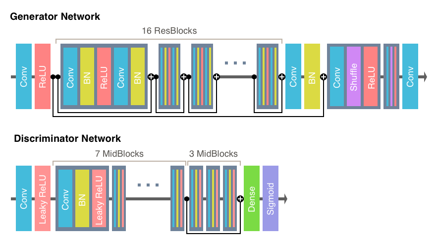

## Super-Resolution Generative Adversarial Network

This repository is based off of an unofficial TensorFlow implementation of [SRGAN](https://arxiv.org/abs/1609.04802) that can be found [here](https://github.com/tensorlayer/srgan). As our ablation study relied only on changing the loss function for SRGAN and not on changing the underlying architecture, we made few changes to the original code for this model beyond fixing a few bugs to get it up and running. We did, however, change the generator network's loss function, which can be found in `main.py`. 

To run this model, we used [TensorFlow](https://www.tensorflow.org) 1.4 and [TensorLayer](https://github.com/tensorlayer/tensorlayer) 1.8.0+.


### SRGAN Architecture

We used TensorFlow to implement the architecture from the paper ["Photo-Realistic Single Image Super-Resolution Using a Generative Adversarial Network"](https://arxiv.org/abs/1609.04802) as depicted here:

<a href="http://tensorlayer.readthedocs.io">
<div align="center">
	
</div>
</a>


### Preparing the Data and Downloading the Pre-trained VGG19 Model

* Download the pretrained VGG19 model from [here](https://mega.nz/#!xZ8glS6J!MAnE91ND_WyfZ_8mvkuSa2YcA7q-1ehfSm-Q1fxOvvs) or [here](https://media.githubusercontent.com/media/tensorlayer/pretrained-models/master/models/vgg19.npy).
* Download the data and update the dataset paths in `config.py`.
	* In this experiment, we used images from [DIV2K](https://data.vision.ee.ethz.ch/cvl/DIV2K/), a dataset that provides 800 high resolution images for training and 200 for testing as well as various downsampled versions of the same images. We used the bicubic downscaling x2 data (Track 1, downscaling x2 in the link above). Note that the hyper-paremeters in `config.py` (such as number of epochs) were seleted based on this dataset. If you use a larger dataset, for instance, you may want to reduce the number of epochs.
 	* Make sure to change the following paths in `config.py` so that they point to the correct dataset directories: `config.TRAIN.hr_img_path`, `config.TRAIN.lr_img_path`, `config.VALID.hr_img_path`, `config.VALID.hr_img_path`, `config.VALID.lr_img_path`
	* If you want to use your own images for training or validation, simply organize your data in the same way as DIV2K and set the above paths to your dataset.


### Training and Testing
* To train from scratch, run

```bash
python3 main.py
```

* To evaluate a trained model, run

```bash
python main.py --mode=evaluate 
```

* A pretrained model (for DIV2K) can be found [here](https://github.com/tensorlayer/srgan/releases/tag/1.2.0)


### References
* [1] [Photo-Realistic Single Image Super-Resolution Using a Generative Adversarial Network](https://arxiv.org/abs/1609.04802)
* [2] [TensorLayer: A Versatile Library for Efficient Deep Learning Development](https://arxiv.org/abs/1707.08551)
* [3] [Is the deconvolution layer the same as a convolutional layer?](https://arxiv.org/abs/1609.07009)

### Author
* Heavily based on work by [zsdonghao](https://github.com/zsdonghao)
* [TensorLayer](https://tensorlayer.readthedocs.io/en/stable/) uses the GitHub [here](https://github.com/tensorlayer/tensorlayer) and is based on the paper [here](https://arxiv.org/abs/1707.08551)

### License
* For academic and non-commercial use only.
* For commercial use, please contact tensorlayer@gmail.com.
